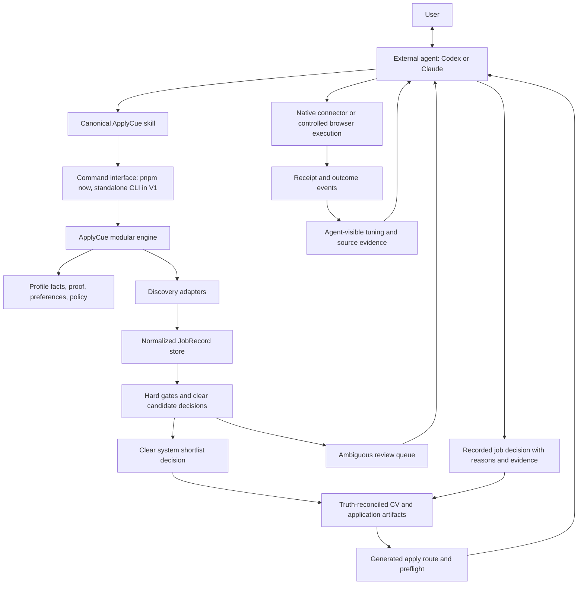

# ApplyCue Hybrid Architecture

Date: 2026-07-10

Status: canonical technical architecture. This document owns system shape, module ownership, runtime boundaries, OSS/provider architecture, persistence, and technical verification. Product identity and settled product decisions live in `PRODUCT_DECISION.md`.

## Product Decision Input

ApplyCue is an external-agent-operated modular monolith. The concise product promise, engine-versus-agent judgement boundary, OSS/career-ops decision, interface path, non-negotiables, and evidence claims are canonical in [`PRODUCT_DECISION.md`](PRODUCT_DECISION.md). This document implements those decisions without restating them as a second product plan.

## System Shape



The agent remains outside the product process. ApplyCue does not call an LLM API to imitate the agent that is already operating it.

## Non-Negotiable Ownership

| Owner | Owns | Must not own |
| --- | --- | --- |
| User | facts, major preferences, permissions, sensitive answers, final-send/final-submit authority | implementation details |
| Codex/Claude | ambiguous fit, conversation, research, shortlist corrections, proposed tuning, tool use on the user's behalf | rechecking every clear row by default, silent fact changes, policy bypass, unapproved sensitive action |
| Canonical ApplyCue skill | modes, safe operating sequence, questions, handoffs | duplicate business logic or model prompts |
| `packages/core` | shared contracts and domain vocabulary | provider-specific parsing |
| `packages/profile` | profile loading, approved facts, proof, preferences, reusable answers | generated job or application truth |
| `packages/discovery` | source adapters, source configuration, source evidence | fit judgement or application permission |
| `packages/normalizer` | conversion to stable `JobRecord` | source fetching or user policy |
| `packages/ranker` | hard gates, clear threshold decisions, and cheap candidate ordering | success probability or pretending ambiguous fit is certain |
| `packages/cv-tailor` | requirement mapping, proof reconciliation, one ATS renderer | invented experience or one-off hand editing |
| `packages/apply-assistant` | application drafts, route planning, pause/submit policy | browser mechanics or user identity truth |
| `apps/browser-agent` and external browser tools | inspect, fill, upload, submit when authorized, capture receipts | facts, CV truth, source trust, or policy overrides |
| `packages/tracker` | progress views, events, source/outcome summaries | a second application source of truth |
| Profile repository | transactions, idempotency, state history, exports | binary document rendering |

## Current Native-Agent AI Runtime

For the current architecture:

- `apps/` and `packages/` should not need OpenAI, Anthropic, Gemini, Ollama, OpenRouter, or another model SDK to deliver the product;
- ApplyCue should not require model API keys;
- prompts should live in the canonical agent workflow, not inside multiple provider-specific application services;
- Codex/Claude reads the candidate queue and supporting artifacts, makes the fuzzy judgement, and records a decision through ApplyCue;
- native agent email, browser, social, and research tools are preferred over rebuilding those capabilities inside ApplyCue;
- the inherited root evaluators and prompt modes have been removed; dated reviews are historical evidence, not runtime owners.

This is the accepted launch runtime. It uses AI, but that AI is supplied by the coding-agent product already operating ApplyCue rather than by an additional model SDK inside `apps/` or `packages/`.

### Agent capability handshake

Native-agent-first does not mean assuming every host has Gmail, Outlook, LinkedIn, Chrome, or the same MCP servers. Before a connector-backed action, the external agent inspects the tools its current host actually exposes, maps them to an ApplyCue capability, and asks for connection or account access only when needed.

The host owns app/MCP discovery, OAuth, tokens, and browser login state. ApplyCue owns the purpose, source approval, normalized records, routes, policy, and receipts. Capability state is session-local; ApplyCue may persist a safe connector reference but never credentials. Public discovery and manual review remain available when a connector is missing or declined.

`docs/connector-capability-policy.md` is the focused owner for this discovery, consent, job-site, and fallback policy.

## AI Judgement Boundary

Native Codex/Claude judgement is the current runtime for ambiguous cases and authorized tool use. No embedded model dependency is required. Hosted, local, and fine-tuned alternatives may enter only through the evidence-triggered trials and promotion gates in [`ai-judgment-trial-plan.md`](ai-judgment-trial-plan.md); that document alone owns model candidates and trial timing.

## Runtime Flow

### 1. Profile and truth setup

The agent passes the user's original DOCX, text-based PDF, Markdown, or text CV to setup. The profile package extracts source text in code while retaining the original file as the authoritative asset. The agent asks only material questions and records approved facts, proof items, preferences, reusable answers, and apply policy in the active profile.

The base CV is a fact source. The proof ledger is the authority for generated claims. A document template is not a truth source.

### 2. Discovery

Discovery uses approved sources in this order:

1. manual roles and user-provided URLs;
2. user mailbox or native agent connectors when approved;
3. direct public ATS/company APIs;
4. bounded broad-board adapters such as JobSpy;
5. deterministic public-page crawling when no structured source exists;
6. live browser inspection as the final fallback.

Every source emits the existing `JobRecord` contract. The rest of the product must not know which library or site produced it.

### 3. Cheap code gates

Code removes or pauses only explainable cases:

- exact and near duplicates;
- closed or stale known postings;
- blocked companies, portals, geographies, work modes, or role families;
- impossible work authorization;
- explicit experience, compensation, shift, travel, or employment-type conflicts;
- fraud and sensitive-document/payment patterns.

Missing or ambiguous evidence is not a hard failure unless user policy says it is.

### 4. Agent judgement boundary

The engine creates an evidence-rich full audit queue with a bounded JD excerpt, full normalized JD path, source URL/date, role metadata, gate results, and ordering reasons. It can classify hundreds of rows cheaply. It owns clear hard-gate failures, clear low-fit decisions, and clear threshold-passing shortlist decisions. Codex/Claude or the user handles only ambiguous `review` rows needed to fill or correct the shortlist, recording a short reason and evidence references.

`RankedJob.decision` is calculated by backend weights and thresholds and is only a system suggestion. `pnpm applycue:record-decision` records one external agent/user decision. `pnpm applycue:record-decisions -- --input <file> --prepare` atomically records a reviewed batch, skips unchanged retries, and immediately runs the non-user preparation work. Both paths preserve reasons, evidence, actor, timestamp, backend suggestion, and failed gates in `data/local/job-decisions.jsonl`, and refuse an `apply` decision when hard gates failed.

Normal CV/application preparation combines clear system `apply` rows with recorded `apply` decisions for ambiguity, up to `applicationsPerDay`. A recorded decision overrides the system classification; unresolved `review`, `watch`, and `skip` rows do not prepare. Current hard gates can still block an older `apply` receipt. UAT uses explicit test-only authority and writes under `outputs/uat`; browser UAT creates any test batch under `outputs/browser-uat/batch`. Neither test path may replace or change the normal latest-run manifest, dashboard, summary, shortlist, or decision authority.

The run manifest labels this boundary as `system_clear`, `hybrid_system_external`, `recorded_external`, `awaiting_external`, or `backend_suggestion_test`. Funnel/status reporting counts only unresolved `review` rows as awaiting judgement while preserving every row in the audit queue. `system_clear`, `hybrid_system_external`, and `recorded_external` are valid normal shortlist authorities. `awaiting_external` means ambiguity blocks a useful shortlist; `backend_suggestion_test` remains test-only.

Reuse the existing `ApplyDecision`, `ProgressJobDecisionItem`, evidence-reference, and tuning concepts. The implementation should add only the smallest missing decision-recording command and provenance fields; it should not create a parallel review system.

### 5. CV and application preparation

For an approved job:

```text
approved facts + proof + base CV + JD
  -> requirement map
  -> content plan
  -> reconciliation
  -> ATS diagnostics
  -> DOCX and review preview
  -> application draft and route
```

Unsupported required claims block or pause. The agent may improve wording through approved inputs and regeneration; it does not hand-edit the final artifact.

### 6. User-authorized action

The agent reads the generated route:

- native connectors first for email and messages;
- controlled browser route for forms;
- manual review for unclear, sensitive, or unsupported paths.

The current page is inspected before filling. The current form-data hash must be approved. Submit/send follows user policy and explicit confirmation rules. Every execution produces a receipt.

### 7. Outcomes and learning

ApplyCue records submitted, confirmation, reply, interview, offer, rejection, withdrawal, and user-feedback events. It shows evidence to the agent; it does not silently train or mutate user preferences.

The agent proposes reusable tuning. The user approves consequential changes. ApplyCue applies them through the existing dry-run and tuning workflow.

## Durable Local State

The target local store is one SQLite database per profile:

```text
~/.applycue/profiles/<profile>/applycue.db
```

Store structured state in the database:

- profile facts, proof, answers, preferences, and source approvals;
- normalized jobs and source observations;
- run state and adapter attempts;
- backend suggestions and recorded agent/user decisions;
- applications, routes, receipts metadata, and outcomes;
- tuning proposals and approval history;
- idempotency keys, profile leases, and migrations.

Keep assets and large/generated artifacts as files:

- source CVs and attachments;
- generated DOCX/HTML/Markdown; add other formats only after a verified need;
- page snapshots and browser receipts;
- human-readable Markdown/JSON exports.

Store artifact paths, hashes, types, and provenance in SQLite. Continue generating JSON and Markdown views so agents and users can inspect state without querying a database.

Use a profile-repository interface so hosted operation can later move shared state to PostgreSQL. Do not add PostgreSQL, Redis, Temporal, or distributed workers until measured shared workloads require them.

## Concurrency and Restart Safety

Local scale needs disciplined in-process orchestration, not distributed infrastructure:

- one profile-scoped lease for state-changing runs;
- idempotency keys for prepare, apply, submit, and outcome operations;
- bounded per-provider concurrency and rate limits;
- timeouts, categorized retry rules, and backoff;
- resumable run and adapter-attempt records;
- atomic artifact writes followed by hash registration;
- independent failure isolation per source.

Top-level ATS and job-board work, plus high-fan-out ATS detail fetches, now use a small product-owned bounded worker pool. This closes the immediate unbounded-`Promise.all` gap without adding another dependency. `p-queue` remains a good trial only when real provider evidence requires interval rate windows, cancellation, priority, or retry scheduling. It would still not be a durable queue: SQLite run records provide durability, while any in-memory queue schedules only current-process work.

## OSS Adoption Policy

An external component is adopted only when all are true:

1. its license and distribution obligations are acceptable;
2. it is maintained or sufficiently stable for its narrow job;
3. it removes more custom maintenance than it adds;
4. it sits behind an ApplyCue-owned interface;
5. a fixture/contract trial proves the required behavior;
6. ApplyCue still owns truth, policy, state, receipts, and outcomes;
7. disabling it has a documented fallback.

Popularity is evidence, not the decision. A smaller specialist tool may be used as an optional adapter when it removes substantial site-specific work and is cheap to replace. A small mutable external dataset must not silently become runtime authority.

## OSS Decision Matrix

Research snapshot: 2026-07-10. Recheck versions, licenses, and maintenance before implementation.

| Area | Candidate | License | Decision | ApplyCue boundary and rollback |
| --- | --- | --- | --- | --- |
| Browser mechanics | [Playwright](https://github.com/microsoft/playwright) | Apache-2.0 | **Keep** | Browser executor only; manual/native-agent route remains fallback |
| DOCX export | [`docx`](https://github.com/dolanmiu/docx) | MIT | **Keep** | Renders reconciled content; renderer can be swapped |
| Tests | [Vitest](https://github.com/vitest-dev/vitest) | MIT | **Keep** | Test runner only |
| Local database | [`better-sqlite3`](https://github.com/WiseLibs/better-sqlite3) | MIT | **Trial, then direct adoption** | Behind profile repository; JSON export/migration is rollback |
| Runtime JSON validation | [Ajv](https://github.com/ajv-validator/ajv) | MIT | **Trial, then direct adoption at external boundaries** | Validates config, adapter input/output, and artifacts; TypeScript contracts remain domain source |
| In-process scheduling | Small ApplyCue worker pool now; [`p-queue`](https://github.com/sindresorhus/p-queue) if measured needs grow | MIT for `p-queue` | **Keep small current owner; trial OSS on trigger** | Current bound limits fan-out. Trial `p-queue` only for interval rate windows/cancellation/retry scheduling; SQLite owns durable state |
| DOCX import | [Mammoth.js](https://github.com/mwilliamson/mammoth.js) | BSD-2-Clause | **Keep, implemented** | Raw-text extraction only; original source remains authoritative; remove dependency to fall back to text import |
| PDF import | [PDF.js](https://github.com/mozilla/pdf.js) | Apache-2.0 | **Keep, implemented for text PDFs** | Extracts text only; source file remains authoritative; image-only PDFs fail clearly until OCR is justified |
| Broad boards | [JobSpy](https://github.com/speedyapply/JobSpy) | MIT | **Keep as replaceable sidecar** | Per-board source lane; direct ATS/manual/email lanes survive failure |
| Open ATS snapshots/directory | [JobHive](https://github.com/kalil0321/ats-scrapers) | MIT | **Review-only sidecar implemented** | Filtered per-ATS Parquet queries and bounded company seeds emit only `JobRecord`; disable source to roll back |
| Repeated public-page crawling | [Crawlee](https://github.com/apify/crawlee) | Apache-2.0 | **Defer until a repeated source needs it** | Discovery adapter only; external-agent browser remains fallback |
| Agent tool exposure | [MCP TypeScript SDK](https://github.com/modelcontextprotocol/typescript-sdk) | MIT/Apache-2.0 transition | **Defer; optional thin adapter** | CLI remains canonical. If trialed, pin the production-recommended v1 line while v2 is pre-stable |
| Local fuzzy search | [Fuse.js](https://github.com/krisk/Fuse) | Apache-2.0 | **Defer** | SQLite FTS5 and current normalization cover the immediate need |
| Resume UX/reference | [Resume Matcher](https://github.com/srbhr/Resume-Matcher) | Apache-2.0 | **Reference only** | Study workflow and evaluation UX; do not import its AI runtime or second data store |
| Resume UX/reference | [Reactive Resume](https://github.com/amruthpillai/Reactive-Resume) | MIT | **Reference only** | Later template/editor inspiration; not truth or matching owner |
| Agentic browser frameworks | Browser Use, Stagehand, similar | permissive varies | **Defer/reject for current design** | They duplicate Codex/Claude judgement and can create a second action owner |
| JSON Resume | active package/moved legacy repo | MIT | **Defer** | Optional import/export compatibility only, never proof authority |
| AGPL application stacks | Firecrawl OSS, OpenResume, ApplyPilot, similar | AGPL-3.0 | **Reject as product dependency** | Hosted API only if separately approved; ideas are not dependencies |
| Full career-ops runtime | historical fork | MIT history with retained notice | **Removed from this branch** | Historical reviews remain; never restore it as a second engine or fallback |

### JobHive replacement for the non-commercial reverse-ATS input

The old `Feashliaa/job-board-aggregator` data dependency has been removed from runtime code. `provider: "ats_directory"` now reads JobHive's MIT-licensed per-ATS company CSVs, validates every HTTPS URL against the expected ATS host, samples a bounded number of companies, and then uses ApplyCue's own direct ATS fetchers. It remains explicitly configured and the canary remains opt-in because a directory scan can fan out into many employer requests.

For India discovery, the stronger lane is `provider: "jobhive"`: a small Python/DuckDB sidecar queries selected remote JobHive Parquet slices with location and whole-term title predicates, then emits ApplyCue-owned `JobRecord` values. It does not download the multi-gigabyte aggregate snapshot and it owns no ranking, CV truth, source approval, application permission, or user state.

The 2026-07-11 contract trial returned 30 India product-title jobs from selected Rippling, Recruitee, Pinpoint, and BambooHR slices in about 18 seconds, with no provider warning and no `product`/`production` substring false positive. This is enough for review-only source adoption, not default promotion. JobHive stays non-auto-approved until repeated source scorecards establish unique qualified yield, freshness, failure rate, overlap, and outcome value against JobSpy and direct ATS sources. Disabling the source restores the current JobSpy/direct/manual/email lanes.

## Provider Architecture

Direct public ATS APIs remain the preferred source because they are structured and intended to publish active jobs. Current official examples include:

- [Greenhouse Job Board API](https://developer.greenhouse.io/job-board.html);
- [Lever Postings API](https://github.com/lever/postings-api);
- [Ashby Job Postings API](https://developers.ashbyhq.com/docs/public-job-posting-api);
- [SmartRecruiters Posting API](https://developers.smartrecruiters.com/docs/endpoints).

Each provider should implement one small ApplyCue contract:

```text
approved source config
  -> fetch with timeout/rate policy
  -> validate source response
  -> map rows to RawJobInput/JobRecord
  -> attach source evidence
  -> return partial success or categorized failure
```

A clean public-API provider is often 40-200 lines. The provider platform is much larger because shared validation, liveness, retries, concurrency, dedupe, history, fixtures, observability, and maintenance dominate the cost.

Add a provider only when it adds verified coverage or resilience beyond active ApplyCue adapters and has an approved source/licence. Historical career-ops reviews may identify a product gap, but the removed scanner, tracker, prompt modes, and batch control plane must not return.

## Math and Research Boundary

Math is useful when it makes the agent queue cheaper, less repetitive, or more honest. It is not a substitute for judgement.

### Use now or trial soon

1. **Exact identity and canonicalization**
   - canonical URL and source ID;
   - normalized company/title/location;
   - content hash for exact duplicates.

2. **Token-set similarity for near duplicates**
   - use explainable Jaccard/token overlap for same-company similar-role detection;
   - MinHash is unnecessary at current volumes and is deferred until the corpus is large enough to justify approximate sketches.

3. **Lexical retrieval with SQLite FTS5/BM25**
   - use FTS5 to retrieve and order a compact candidate set from title, company, description, and location;
   - SQLite documents a built-in [`bm25()`](https://www.sqlite.org/fts5.html) function and column weighting;
   - this is retrieval evidence for the agent, not a probability of getting hired.

4. **Reciprocal Rank Fusion only when lists genuinely differ**
   - if source recency, lexical retrieval, and approved preference ordering each produce useful independent lists, combine ranks with simple RRF;
   - the original [RRF paper](https://cormack.uwaterloo.ca/cormacksigir09-rrf.pdf) supports rank-based fusion without pretending incomparable raw scores share one scale;
   - do not add a conductor or fusion layer before two proven lists exist.

5. **Honest source outcome rates**
   - raw `1/1` or `1/2` success rates are misleading;
   - once outcomes exist, show counts and a Wilson or Bayesian interval rather than a naked percentage;
   - current research still finds Wilson/Bayesian intervals preferable to naive normal intervals in many binomial settings: [Hofer and Held](https://arxiv.org/abs/2207.03199).

6. **Evaluation metrics**
   - use agent/user-labelled `precision@5`, `precision@10`, correction rate, and time-to-useful-shortlist;
   - use nDCG only when labels have graded relevance and enough examples; the original [cumulated-gain work](https://trepo.tuni.fi/handle/10024/65718) explains why highly relevant results should receive more credit near the top.

### Defer

- embeddings and cross-encoders;
- learned-to-rank models;
- graph matching and knowledge-graph scoring;
- fine-tuning;
- source-budget bandits;
- fit or offer-probability scores.

Learned job retrieval research such as [Learning to Retrieve for Job Matching](https://arxiv.org/abs/2402.13435) relies on confirmed-hire data and learned interaction structure. ApplyCue does not yet have the labelled outcome volume needed to justify such a model.

ESCO and O*NET can help an agent propose title/skill expansions, but they stay optional evidence:

- [ESCO](https://esco.ec.europa.eu/en/use-esco/use-esco-services-api) provides a multilingual occupation/skill classification under its stated API licensing;
- [O*NET Web Services](https://services.onetcenter.org/about) provides US occupation, task, skill, and technology data with attribution requirements.

Neither taxonomy should hard-block a job or overwrite user terminology. Codex/Claude can consult them during research and record approved reusable title variants through tuning.

## Current State Versus Target

| Capability | Current | Target gap |
| --- | --- | --- |
| External-agent operation | Canonical skill and pnpm-backed worker commands are active; the legacy runtime is absent | Publish a thin standalone CLI in V1; optional MCP only after CLI stability |
| Truth/proof/CV reconciliation | Active and tested, including DOCX and text-PDF source import | Add runtime schema validation; trial OCR only if real image-only PDFs justify it |
| Direct ATS and board discovery | Broad active coverage; JobHive is available as a review-only India snapshot source and MIT company-directory seed; bounded source/detail work and configured-source canaries are active; The Muse stays explicit after its live canary failed | Compare JobHive overlap, freshness, unique qualified yield, and outcomes against JobSpy/direct ATS; add payload validation and per-provider rate/retry policy before default promotion |
| Candidate judgement | Clear system matches and recorded ambiguity decisions combine under explicit authority; current real-profile operation proves the hybrid path | Build a labelled benchmark and measure user corrections/outcomes; do not add an embedded model now |
| Browser routes and receipts | Active local and live preflight paths | Build representative real-portal compatibility evidence |
| Persistence | JSON/JSONL/files | Move structured state to per-profile SQLite with exports |
| Restart/concurrency safety | Source/detail fan-out is bounded; append-file state and run restart remain partial | Add leases, idempotency, persisted attempts, rate windows, cancellation, and resumable runs |
| Outcomes/tuning | Contracts and reports exist | Accumulate real outcome cohorts and use honest uncertainty |
| Agent integration | Canonical skill plus pnpm-backed worker command router | Standalone V1 CLI with structured output and exit codes; optional thin MCP after stability |
| Host connector discovery | Workflow names native connectors but live cross-harness discovery is not yet proved | Prove the capability handshake, one email read/import flow, and one preferred logged-in job-site session for MVP; add structured CLI capability status in V1 |

## Implementation Sequence

Version placement and exit criteria are canonical in [`product-roadmap.md`](product-roadmap.md). This architecture contributes the technical gaps in **Current State Versus Target** and the verification gates below; it does not maintain a second phase plan.

## Verification Gates

Every architecture slice must prove:

- contract and migration tests;
- one happy path and one degraded/failure path;
- no new source of truth;
- no user data written into the repo;
- the current launch path requires no embedded model key;
- any later hosted model adapter is optional, disabled without explicit configuration, and has a tested rollback to native-agent/user review;
- adapter disable/rollback path;
- deterministic hard gates and truth reconciliation remain authoritative;
- agent/user decision provenance is visible;
- application action has current preflight, policy, and receipt evidence;
- `pnpm applycue:check` and relevant UAT paths pass.

Tool adoption is not complete after installation or a smoke test. Discovery tools need fixture parity and live canaries. Persistence needs migration and crash/restart proof. Browser tools need representative live-route receipts.

## Success Evidence

Product evidence levels and claim boundaries are canonical in [`PRODUCT_DECISION.md`](PRODUCT_DECISION.md); release gates are canonical in [`launch-readiness.md`](launch-readiness.md). Architecture changes must still expose the technical evidence required by those documents.

## Research and Reference Sources

Primary technical sources:

- [Model Context Protocol TypeScript SDK](https://github.com/modelcontextprotocol/typescript-sdk)
- [OpenAI current models](https://developers.openai.com/api/docs/models)
- [Anthropic current models](https://platform.claude.com/docs/en/about-claude/models/overview)
- [Google Gemini current models](https://ai.google.dev/gemini-api/docs/models)
- [Promptfoo](https://github.com/promptfoo/promptfoo)
- [SQLite FTS5 and BM25](https://www.sqlite.org/fts5.html)
- [`better-sqlite3`](https://github.com/WiseLibs/better-sqlite3)
- [Ajv](https://github.com/ajv-validator/ajv)
- [`p-queue`](https://github.com/sindresorhus/p-queue)
- [Mammoth.js](https://github.com/mwilliamson/mammoth.js)
- [PDF.js](https://github.com/mozilla/pdf.js)
- [Playwright](https://github.com/microsoft/playwright)
- [`docx`](https://github.com/dolanmiu/docx)
- [JobSpy](https://github.com/speedyapply/JobSpy)
- [Crawlee](https://github.com/apify/crawlee)
- [Greenhouse Job Board API](https://developer.greenhouse.io/job-board.html)
- [Lever Postings API](https://github.com/lever/postings-api)
- [Ashby Job Postings API](https://developers.ashbyhq.com/docs/public-job-posting-api)
- [SmartRecruiters Posting API](https://developers.smartrecruiters.com/docs/endpoints)
- [ESCO API](https://esco.ec.europa.eu/en/use-esco/use-esco-services-api)
- [O*NET Web Services](https://services.onetcenter.org/about)

Research references:

- [Reciprocal Rank Fusion](https://cormack.uwaterloo.ca/cormacksigir09-rrf.pdf)
- [Learning to Retrieve for Job Matching](https://arxiv.org/abs/2402.13435)
- [Comparing Confidence Intervals for a Binomial Proportion](https://arxiv.org/abs/2207.03199)
- [Cumulated gain-based indicators of IR performance](https://trepo.tuni.fi/handle/10024/65718)

Product references, not dependencies:

- [Resume Matcher](https://github.com/srbhr/Resume-Matcher)
- [Reactive Resume](https://github.com/amruthpillai/Reactive-Resume)
- historical career-ops evaluations retained under the repository's attribution notice; no forked runtime tree remains

## Product Decision Reference

The settled product call is in [`PRODUCT_DECISION.md`](PRODUCT_DECISION.md). Dated architectural reviews retain the evidence and alternatives that produced it.
